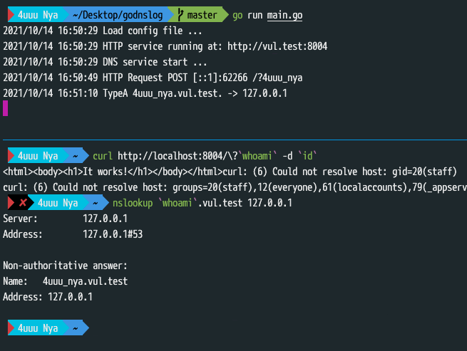
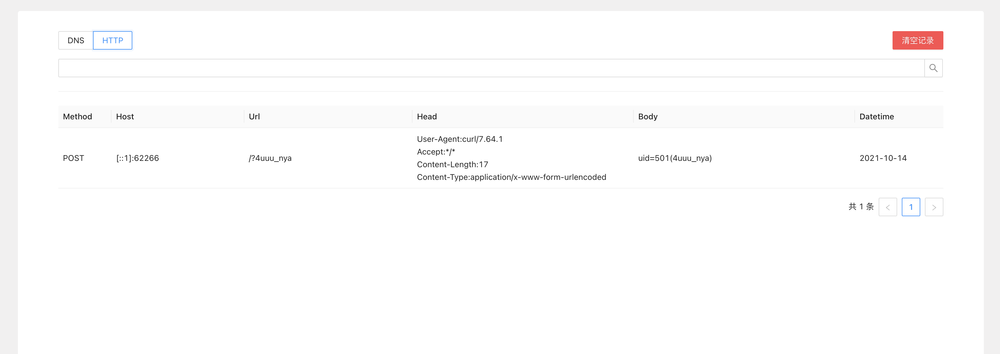
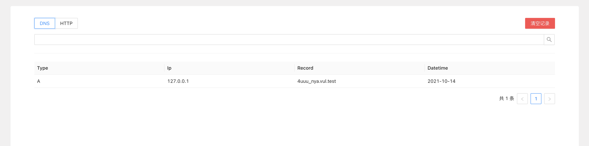

# godnslog

学习golang时的练手项目，支持DNS，HTTP两种记录

TODO

- [ ] 指定地址解析
- [ ] dns rebinding 
- [ ] Docker封装

---

配置文件说明

```yaml
listen: 0.0.0.0     # 监听地址
domain: vul.test    # 绑定域名
http_port: 8004     # http监听端口
http_view: true     # 是否启用管理界面
http_offset: 10     # api返回每页条数
token: admin123     # api鉴权用token
```

若启用管理界面，程序启动后可通过访问 `http://host/admin` ，输入配置文件中指定的token即可进行管理

**不启用管理界面不影响api使用，另外不建议修改返回条数，因为管理界面并没有做这个适配(太懒了)**


---





